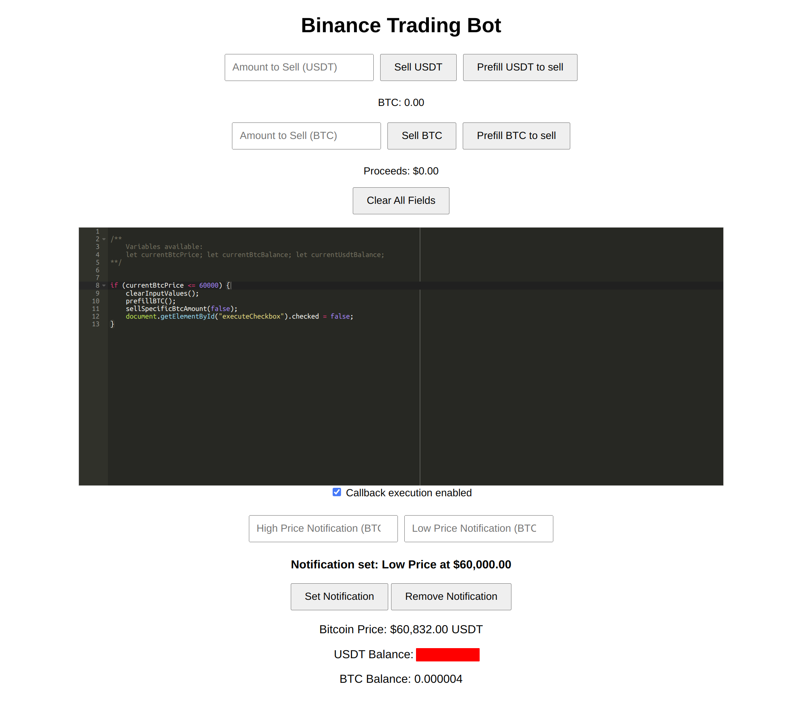

# Binance Trading Bot

## Overview

This Binance Trading Bot is a simple web application that allows users to trade Bitcoin (BTC) on Binance using a REST API. The application includes a frontend interface for buying and selling BTC, checking balances, and setting price notifications. It provides a user-friendly way to interact with your Binance account by integrating real-time price updates and balance displays.



## Features

### Trading
- **Buy BTC**: Buy a specific amount of BTC by entering the amount and confirming the purchase.
- **Sell BTC**: Sell a specific amount of BTC by entering the amount and confirming the sale.
- **Sell All BTC**: Automatically sell the entire BTC balance with a single click.

### Balance & Price Display
- **Real-time BTC Price**: The current BTC price is displayed in the UI and updated every second.
- **BTC & USDT Balance Display**: The current balances for BTC and USDT are displayed and updated every second.

### Notifications
- **Set Price Notifications**: Set up notifications for when BTC price reaches a specific high or low threshold.
- **Remove Notifications**: Clear any set price notifications.
- **Persistent Notifications**: Notifications are saved in cookies and persist across browser sessions.
- **Sound Alerts**: A system sound alert is played twice with a 2-second interval when the price reaches the specified threshold.

### Miscellaneous
- **Pre-fill Sell Amount**: Automatically fill the sell input with the current BTC balance with a single click.
- **Clear Input Fields**: Clear all input fields with a single button click.

## Installation

### Prerequisites
- **Node.js**: Ensure that Node.js (v14 or later) is installed on your system.
- **npm**: npm is included with Node.js, and it is required for installing dependencies.

### Installation Steps

1. **Clone the Repository**
   ```bash
   git clone https://github.com/yourusername/binance-trading-bot.git
   cd binance-trading-bot
2. **Install Dependencies**
   ```bash
   npm install
3. **Create an .env File**

In the root of the project directory, create a .env file.
Add your Binance API credentials to the file:  
   ```bash
      BINANCE_API_KEY=your_binance_api_key
      BINANCE_API_SECRET=your_binance_api_secret
   ```
4. **Run the Application**
   ```bash
   node src/index.js
5. **Run the Application**

Open your web browser and go to `http://localhost:3000` to access the trading bot interface.
   
## Usage

### Main Interface
- **Buying BTC**:
   1. Enter the amount of BTC to buy in the input field.
   2. Click the "Buy BTC" button.
   3. A confirmation dialog will appear. Confirm the transaction to proceed.

- **Selling BTC**:
   1. Enter the amount of BTC to sell in the input field.
   2. Click the "Sell BTC" button.
   3. A confirmation dialog will appear. Confirm the transaction to proceed.

- **Selling All BTC**:
   1. Click the "Sell All BTC" button to pre-fill the sell input field with your entire BTC balance.
   2. Click the "Sell BTC" button.
   3. A confirmation dialog will appear. Confirm the transaction to proceed.

### Notifications
- **Set High/Low Price Notification**:
   1. Enter the desired BTC price threshold in the "High Price Notification" or "Low Price Notification" input field.
   2. Click the "Set Notification" button to activate the notification.
   3. The system will alert you with a sound notification when the price reaches the specified threshold.

- **Remove Notifications**:
   1. Click the "Remove Notification" button to clear any set price thresholds.
   2. Notifications will be disabled and the thresholds will be removed.

### Other Features
- **Pre-fill Sell Amount**:
   1. Click the "Sell All BTC" button to automatically fill the sell input field with your entire BTC balance.

- **Clear Input Fields**:
   1. Click the "Clear All Fields" button to clear all input fields, including buy/sell amounts and notification thresholds.